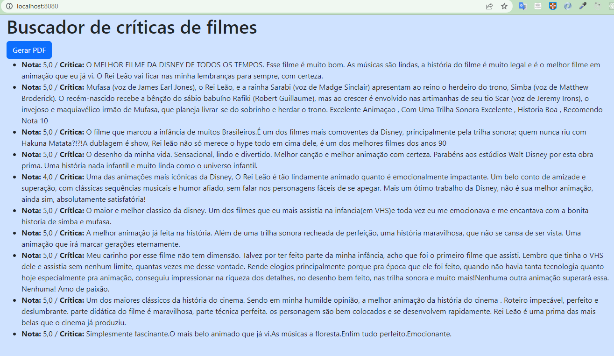

# Treinamento PHP - Fundamentos

## Sobre o projeto *Buscador de Críticas de Filme*

>O projeto *Buscador de Críticas de Filme* faz um crawler (também conhecido como Spider ou Bot) na página de críticas de um determinado filme do site [https://www.adorocinema.com](https://www.adorocinema.com) e exibe a nota e o texto da crítica.

## Instalação

1. Faça o download do código: [Download](.aux/buscador-criticas.zip)
1. Na pasta raiz do projeto, digite na linha de comando:
    ```bash 
    composer install
    ```
3. Suba o servidor embutido com o comando:
    ```bash 
    composer start
    ```

## Desafio

>Persistir os dados em um banco **SQLite** e, apartir de uma consulta SQL, exibir a lista de críticas.
>Considere a estrutura da tabela da seguinte forma:
>```sql
>/* Cria tabela criticas em SQLite */
>CREATE TABLE IF NOT EXISTS criticas (
>   id INTEGER PRIMARY KEY AUTOINCREMENT,
>   nota TEXT,
>   texto TEXT
>); 
>```

## Características

>O projeto utiliza as seguintes dependencias:
>
>* [Cliente HTTP: **guzzlehttp/guzzle**](https://packagist.org/packages/guzzlehttp/guzzle)
>* [Leitor/Navegador do DOM: **symfony/dom-crawler**](https://packagist.org/packages/>symfony/dom-crawler)
>* [Seletor CSS: **symfony/css-selector**](https://packagist.org/packages/symfony/>css-selector)
>* [Gerador de logs: **monolog/monolog**](https://packagist.org/packages/monolog/monolog)
>* [Geradro de PDF a partir de um HTML: **dompdf/dompdf**](https://packagist.org/packages/>dompdf/dompdf)
>
>Exemplo de como foram instalados os pacotes 
>```bash
>composer require guzzlehttp/guzzle
>composer require symfony/dom-crawler
>composer require respect/validation
>composer require monolog/monolog
>composer require dompdf/dompdf
>```
>Exemplo de como foram instalados os pacotes de desenvolvimento
>```bash
>composer require --dev phpunit/phpunit ^8
>```
> <br>

## Captura de telas
### Site de Críticas


### Tela Principal Atual do Buscador (PHP)

